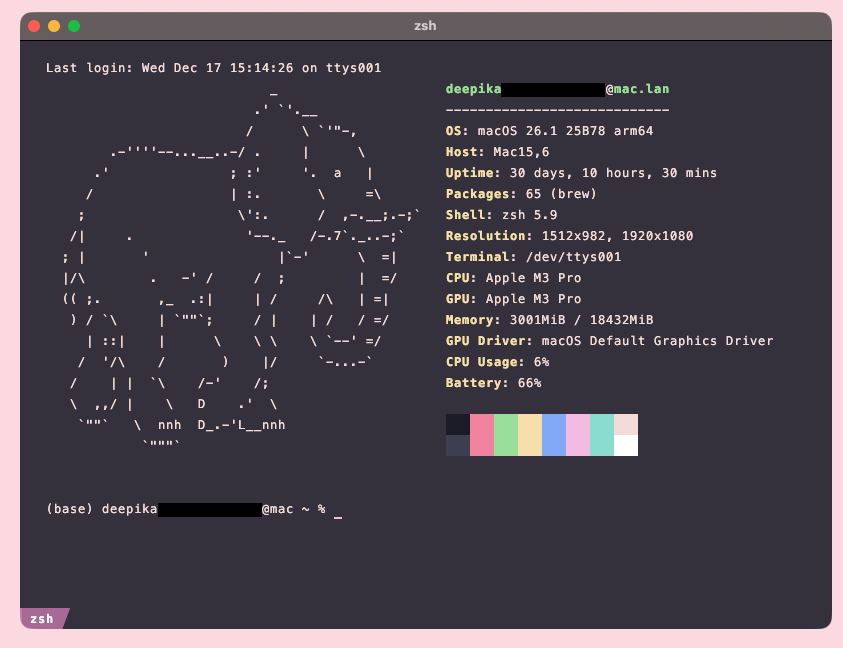

# Kitty Terminal Configuration

This repository contains my custom configuration files for the [Kitty Terminal Emulator](https://sw.kovidgoyal.net/kitty/). It includes two main files:

- **kitty.conf**: The primary configuration file that sets up window behavior, fonts, keyboard shortcuts, and more.
- **pink-theme.conf**: A custom dark mode pink-themed color configuration that is included by `kitty.conf`.

## Overview

These configuration files are designed to enhance your terminal experience with:

- **Custom Window Settings:**  
  Centered window placement, custom padding, and window resizing behavior.

- **Personalized Fonts:**  
  Uses Menlo, VictorMono-BoldItalic, and additional font features for a clean and modern look.

- **Keyboard Shortcuts:**  
  Custom keybindings for common actions like copying, tab navigation, and managing splits.

- **A Unique Color Scheme:**  
  The `pink-theme.conf` file defines a dark mode theme with pink accents, including a tailored palette for text, background, and selection colors.

